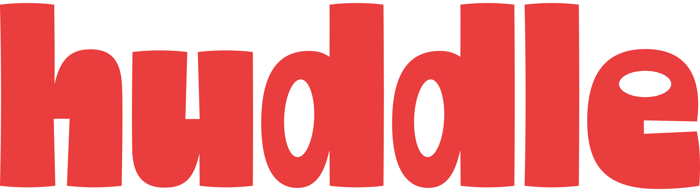

<p align="center">
  
</p>

# Huddle: Private Meeting Notes, Made on Your Mac


**Huddle** records your meetings and turns them into transcripts, speaker-separated conversations,
summaries, decisions and action items, **entirely on your own Mac**. No account, no cloud, no
subscription. Put your MacBook on the table for an in-person meeting, or let it listen to the
other side of a video call; press Stop and the notes write themselves while nothing leaves your
computer.

---

## 🚀 Key Features

### 🎙️ Recording
* **In the room or on a call:** records the microphone and, optionally, the audio of every other
  app on your Mac (Teams, Zoom, Meet, FaceTime).
* **Menu bar mode:** close the window and Huddle keeps a small recorder in the menu bar. Click it
  or press **⌥⌘R** to start and stop from anywhere.
* **Crash-safe:** the audio file is finalised every second, so a lost battery still leaves a
  recoverable recording.
* **Import:** drop in an existing audio file and get the same treatment.

### ✍️ Notes
* **Transcript with speakers:** who said what, with timestamps. Rename or merge speakers; Huddle
  suggests names it recognises from earlier meetings.
* **Summary, topics, decisions:** structured notes with evidence links back into the transcript,
  written in the language you choose (56 languages) whatever language was spoken.
* **Action items:** extracted on demand and tracked across meetings until you tick them off.
* **Refine:** tell Huddle what it got wrong  and it
  rewrites the notes.
* **Ask:** ask one meeting or all of them a question.

### 🔒 Private by design
* **Everything runs locally:** transcription, speaker separation and summaries all run on your
  Mac. Huddle works fully offline once the models are downloaded.
* **Your data stays yours:** recordings, transcripts and notes live in one folder under
  Application Support. Export any meeting as Markdown, text, SRT, JSON, or the original audio.
* **Storage limit:** set how much disk recordings may use; older audio is pruned first.

### 🤖 Works with your AI tools
* **MCP server:** Claude Desktop, Claude Code, Cursor and other MCP clients can search your
  meetings, read transcripts and pull open action items, without touching your filesystem.
  Settings → MCP shows the ready-made configuration for each client.
* **Network access (optional):** share the MCP server on your local network with API keys.
* **Bring your own models:** Huddle finds models you already have (Ollama, LM Studio, Hugging
  Face cache) and only downloads what is missing.

---

## 📦 Install

Requirements: a Mac with **Apple Silicon** running **macOS 14.2 or newer**. About 1 GB of disk
for the app plus the models you choose (the recommended set is around 5 GB). At least 16 GB of RAM is recommended, but small AI models will probably also work on 8 GB of RAM.

1. Download `Huddle-<version>-macos-arm64.zip` from the latest [release](../../releases/latest),
   unzip it and drag `Huddle.app` into Applications.
2. Open it. On first launch Huddle asks for the microphone and, if you want the other side of
   calls, system audio. It then checks what is already on your Mac and offers the model
   downloads it needs.

---

## 🧑‍💻 Development

Requirements: macOS (Apple Silicon), Xcode Command Line Tools, Node 20+, Rust,
Homebrew Python 3.11 (`python3.11`).

```bash
# 1. engine
cd engine
python3.11 -m venv .venv
.venv/bin/pip install -r requirements.txt
.venv/bin/python -m pytest                 # tests
.venv/bin/python -m huddle_engine doctor   # hardware, providers, models, resolution

# 2. system-audio helper (Swift; needs Xcode Command Line Tools)
../scripts/build-audio-tap.sh

# 3. speaker models (bundled into the app)
../scripts/fetch-speaker-models.sh

# 4. desktop app (starts Vite + Tauri; the app spawns engine/.venv automatically)
cd ../apps/desktop
npm install
npx tauri dev
```

---

## ❤️ Credits & Acknowledgment

Huddle stands on excellent open-source work:

* **Transcription:** [Whisper](https://github.com/openai/whisper) via [mlx-whisper](https://github.com/ml-explore/mlx-examples) and [CTranslate2](https://github.com/OpenNMT/CTranslate2)
* **Speaker separation:** [sherpa-onnx](https://github.com/k2-fsa/sherpa-onnx) with the [pyannote](https://github.com/pyannote/pyannote-audio) segmentation model and NVIDIA's TitaNet embeddings
* **Notes:** [Ollama](https://ollama.com) running local models such as Qwen
* **App:** [Tauri](https://tauri.app), [React](https://react.dev), [Tailwind CSS](https://tailwindcss.com), [FastAPI](https://fastapi.tiangolo.com)

Huddle is created by me with extensive assistance from **Claude Fable 5.1** (Anthropic) as
a co-pilot for architecture, implementation and debugging.

---

## 📄 License

Huddle is released under the [MIT License](LICENSE).
